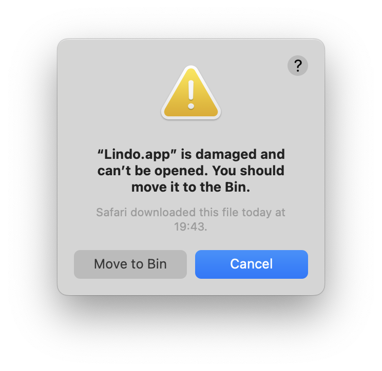

# Lindo POC

## Overview
This project is a rewrite of the `Lindo` application with the latest technologies under React, Typescript, Vite and electron and security in mind. It will also featuring dynamic plugin integration with systemJS and rollup.
It also provide an easy way to share the application state across the browsers and the electron process with mobx and a synchronisation with IPC (heavely inspired by [electron-vite-boilerplate](https://github.com/klarna/electron-redux) ).


## Run the arm64 mac os version for M1/M2 processors

- Drop the **Lindo.app** into your `/Applications` folder
- Then open the `Terminal` application and run the following command:
```bash
xattr -d com.apple.quarantine /Applications/Lindo.app
```

## Quick start
TODO 

## Debug

<!--
```sh
# install dependencies
yarn install

# start the application
yarn dev

# make a production build
yarn build
```
-->

## Directory structure

Once `dev` or `build` npm-script is executed, the `dist` folder will be generated. It has the same structure as the `packages` folder, the purpose of this design is to ensure the correct path calculation.

```tree
├── build                     Resources for the production build
|   ├── icon.icns             Icon for the application on macOS
|   ├── icon.ico              Icon for the application
|   ├── installerIcon.ico     Icon for the application installer
|   └── uninstallerIcon.ico   Icon for the application uninstaller
|
├── dist                      Generated after build according to the "packages" directory
|   ├── main
|   ├── preload
|   └── renderer
|
├── release                   Generated after production build, contains executables
|   └──{version}
|       ├── win-unpacked      Contains unpacked application executable
|       └── Setup.exe         Installer for the application
|
├── scripts
|   ├── build.mjs             Develop script -> npm run build
|   └── watch.mjs             Develop script -> npm run dev
|
├── packages
|   ├── main                  Main-process source code
|   |   └── vite.config.ts
|   ├── preload               Preload-script source code
|   |   └── vite.config.ts
|   └── renderer              Renderer-process source code
|       └── vite.config.ts
```


## `dependencies` vs `devDependencies`

- First, you need to know if your dependencies are needed after the application is packaged.

- Like [serialport](https://www.npmjs.com/package/serialport), [sqlite3](https://www.npmjs.com/package/sqlite3) they are node-native modules and should be placed in `dependencies`. In addition, Vite will not build them, but treat them as external modules.

- Dependencies like [Vue](https://www.npmjs.com/package/vue) and [React](https://www.npmjs.com/package/react), which are pure javascript modules that can be built with Vite, can be placed in `devDependencies`. This reduces the size of the application.
